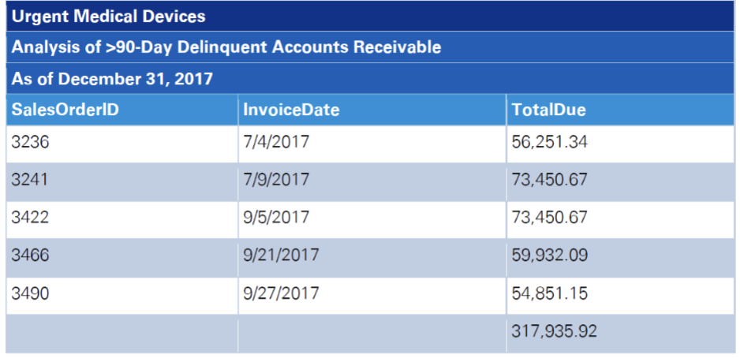

**Background**

Urgent Medical Device, Inc. (the Company) is a medical device company founded in 2013 in Provo, Utah that specializes in the development and manufacturing of cutting-edge medical devices designed for all types of joint replacement surgeries. In January 2015, the FDA approved Urgent’s premier product, a hinged titanium axle designed to provide physicians with more precise placement of joints during joint replacement surgery.

In early 2016, approximately one year after the new product’s approval, the Company hired a new senior vice president (SVP) of sales to oversee sales, physician training, product delivery, and customer service. The broad set of responsibilities allowed the charismatic SVP to significantly influence the Company’s revenue generation. The hiring of the new SVP was also done in large part to help guide the company’s development of an important new sales channel: third-party distributors that are each strategically located in close proximity to key hospitals in regions around the country.

The move to hire the SVP was in direct response to overwhelming disappointment about the first year’s sales volume for the new surgical implant, which was lagging significantly behind expectations. Reports from the field led management to recommend the new sales channel to the board of directors that overwhelmingly approved the new strategy, the execution of which was being led by the new SVP.

**Execution of Strategy**

To help execute the new strategy, the SVP hired five regional sales managers who would become his trusted cohorts. Together, they set aggressive sales targets for the Company’s surgical implants. The sales targets focused on achieving a growth pattern that was characterized by a record high sales volume for each successive quarter in each region. In fact, it is fair to say that the sales targets were intentionally created at almost unreachable levels to remove any question about possible weakness in demand for the Company’s new product.

The strategy focused on the development of a new sales channel with third-party distributors. Each of the distributors had already established close relationships with the physicians that were actually using the product during surgical procedures. To help pay for the launch of their new product, along with the execution of the new strategy, the Company was also working hard to raise a significant amount of new investment capital to fund the resulting increased operating costs. In order to be successful in attracting the new investment capital, top management made it clear to the SVP how important it was to report strong sales for its premier product, the surgical implant for titanium joints. The SVP, in turn, passed along the same message to the regional sales managers.

**Management Control Philosophy**

The upper management team of Urgent can be described as being aggressive in business practices and often emphasizes speed and efficiency when implementing their decisions. Management rarely hires external consultants because they are of the opinion that consultants are too expensive and often follow a conservative approach. The upper management team meets regularly with its key managers. In general, the upper management team has cooperated with the audit team in order to provide fair and adequate financial reporting, but there have been disagreements in the past. The Company has a strict policy for following all established internal control procedures.

**Incentive Compensation**

Top management focuses significant attention on achieving short-term performance measures based on the audited financial statements when determining compensation and making promotion decisions. Revenue earned is the most important criterion in performance assessment throughout the organization. As part of the launch of its new surgical implant, a new bonus plan was established to provide additional incentives for the entire organization to focus on this new opportunity, with revenue earned as the key criterion used to determine incentive compensation.

**Preliminary Results**

Despite the SVP’s optimism about sales in 2017, internal reports have indicated that the actual sales volume of the surgical implant was well below budget each quarter. The SVP responded to these reports by repeatedly communicating his disappointment to the regional sales managers. Furthermore, he consistently warned that if the team could not boost sales, the Company would likely not be able to raise additional investment capital and would then be forced to significantly downsize its headcount.

Unfortunately, boosting revenue of the new surgical implants was not as simple as merely shipping the product to distributors. The distributors were hesitant to purchase product until the sale to the final customer was finalized as the distributors did not want to be stuck with the inventory on their own balance sheets. Further, the terms of the sales do not include any refund or rebate conditions. In addition, the Company has no intention of changing those terms and accepting any return. Therefore, any sale to distributors are final.

By the end of 2017, the Company had signed on a total of 73 distributors to sell its surgical implants in more than 20 different states throughout the United States. Each distributor was independently owned and operated but the company routinely shared best practices among its network. The SVP monitored sales closely from the distributor network through his regional sales managers. In fact, he even maintained a monthly sales report from each of the 73 distributors.

The Company invoices customers (including distributors) when the goods are shipped, and invoicing triggers the recording of revenue. The Company does not include freight costs in sales revenue but does offset shipping costs with any freight charged to customers.

The following relevant financial data is taken from the Company’s unaudited trial balance, which was used to produce the unaudited financial statements:

| Sales revenue, year ended 12/31/2017  | $84,867,855 |
| ------------------------------------- | ----------- |
| Gross accounts receivable, 12/31/2017 | $11,988,886 |

**Audit Approach**

Your audit team is currently in the midst of year-end testing in the revenue and accounts receivable cycle for the audit of the calendar year 2017 financial statements. Your testing will focus on the existence/occurrence, cutoff, and accuracy assertions for sales revenue, as well as the existence and valuation assertions for accounts receivable. As relationships with third-party distributors generally require significant contract analysis to ensure the appropriateness of when revenue is recognized, the audit team expects more hours to be spent this year testing revenue and accounts receivable as compared to the prior year. In addition to the procedures you will perform, the audit team will also confirm accounts receivable and perform other procedures according to the audit plan. The audit team has assessed the risk of material misstatement (RMM) for each relevant assertion in order to determine the nature, timing, and extent of the procedures to be performed at Urgent.

Other members of the audit team have already completed a walk-through of the revenue and accounts receivable processes and identified the controls that have been placed in operation to mitigate risks. Based on the work performed, the team decided to test the operating effectiveness of certain key controls during interim testing. The results are found below.

**Tests of controls – Revenue and accounts receivable cycle – Interim**

There were four key application controls tested at interim. Prior to testing the application controls, the information technology (IT) auditors tested the IT General Controls (ITGCs) over program changes, access to programs, and computer operations that are relevant to the revenue and accounts receivable cycle. The ITGCs were found to be effective and can be relied upon to support the effective operation of application controls. In addition, the IT auditors tested the system to ensure proper segregation of duties throughout the period and that controls over data input, data integrity, and the completeness and accuracy of data used in the four application controls were operating effectively. No exceptions were noted in the testing performed by the IT auditors, and the team decided to test the four key application controls themselves.

The first control is an automated three-way sales match. The control matches the details from 1) an approved sales order; 2) relevant shipping documents; and 3) the sales invoice before revenue is recorded. The control has been designed to support the existence/occurrence assertion for revenue. A test of the control’s operating effectiveness was conducted at the interim. No exceptions were noted.

The second control requires the credit department at Urgent to conduct a detailed credit check for all new customers, including the new distributors. To do so, the credit department obtains information from the customer that allows for a comprehensive review of the financial condition of the new customer and an assessment of the customer’s capacity to pay outstanding invoices. The control culminates with an approval of the new customer and the establishment of a credit limit by the credit department manager based on the information reviewed. A test of the control’s operating effectiveness was conducted at interim. No exceptions were noted

The third control is an automated sales authorization control. When a sales order is entered into the system, the amount of the sale is added to the existing accounts receivable balance for that customer. The sum is then compared to the customer’s credit limit. If the sum is greater than the credit limit, the sale is not approved. If the sum is less than the credit limit, the sale is approved. A credit manager notes the approval and authorizes shipment by electronically entering their initials into the system, which gets posted into the sales order database. A test of the control’s operating effectiveness was conducted at interim. No exceptions were noted.

The fourth control is a monthly review of the adequacy of the allowance for doubtful accounts, completed by the controller. On a monthly basis, the controller reviews the aging of accounts receivable report, which is automatically produced by the company’s information system. During the review, the controller identifies for follow-up all balances greater than 90 days past due for consideration in the allowance calculation. A test of the control’s operating effectiveness was conducted at interim. No exceptions were noted.

**Roll-forward Period**

By the end of the third quarter of 2017, sales revenue for the company’s premier surgical implant was still lagging far behind expectations. To help ensure that Urgent delivered impressive fourth quarter revenue numbers, the entire sales team, led by the SVP and the regional sales managers, began to exert pressure on a number of distributors in an attempt to improve sales in 2017. This effort seemed to be paying off as the sales team successfully persuaded more than a dozen distributors to purchase product in advance of final customer demand.

These circumstances presented a problem for the Company, because the distributors began to ask for concessions from Urgent Medical. For example, in order to persuade the distributors, the Company agreed to hold the inventory in their own warehouse.

The SVP’s actions led to a dramatic increase in revenue for the fourth quarter of 2017. In fact, sales increased year-over-year by 214 percent for the fourth quarter alone. The upward trajectory of sales revenue helped the Company raise the much-needed investment capital as Urgent issued more than 10 million shares of common stock for $40 million in early 2018.

Most importantly, roll-forward testing procedures were completed for each of the four key application controls. No exceptions were noted in the roll-forward procedures. Thus, the audit team concluded that the controls were operating effectively throughout the year.

**Section 1: Substantive Testing – Revenue and Account Receivable (70 points)**

As a result of the tests of controls, the audit team assessed the control risk as low for the existence/occurrence, cutoff, and the accuracy assertions for revenue and the valuation assertion for accounts receivable. Since the recognition of revenue is a presumed fraud risk, along with the significant risk of sales cutoff related to the launch of the new surgical implant, the audit team concluded that fraud risk related to the timing of revenue recognition over period-end is high. Overall, based on the control risk assessment if low and the inherent risk assessment of high, the overall assessment of RMM is moderate for each of the assertions. In response to the RMM assessment, the audit team has asked that you complete a number of substantive testing procedures. In addition, since your manager is trying to improve the efficiency and effectiveness of substantive testing, you have been asked to use technology to facilitate identification of potential concerns related to the substantive testing for the revenue and accounts receivable cycle. Urgent has provided you with the data files listed in belowto facilitate your testing (**each data file is included with the assignment on Canvas**).

1. **SalesOrders** – Urgent has provided the SalesOrders database, which includes a master listing of all customer orders placed during the year. The client has informed you that the database also includes sales orders from the prior year that were not completed until the current year, as well as orders taken this year that were not delivered to customers as of 12/31. This database is also the client’s primary database for the three-way match control. When an order is shipped or invoiced, the system automatically posts the ShipID or Invoice ID to the SalesOrders database.

| **Column name** | **Column description**                                        | **Field type**    |
| --------------- | ------------------------------------------------------------- | ----------------- |
| SalesOrderID    | Customer order number                                         | Numeric (int)     |
| OrderDate       | Date the customer order was created                           | Date MM/DD/YYYY   |
| ProdID          | Product Number                                                | Character         |
| CustID          | Distributor Number                                            | Numeric (int)     |
| TerritoryID     | Territory in which the sale was made                          | Numeric (int)     |
| Quantity        | Quantity Ordered                                              | Numeric (int)     |
| UnitPrice       | Price per unit                                                | Numeric (dollars) |
| SubTotal        | Sales subtotal, amount included in Sales Revenue              | Numeric (dollars) |
| TaxAmt          | Tax amount                                                    | Numeric (dollars) |
| Freight         | Shipping Cost                                                 | Numeric (dollars) |
| TotalDue        | Total due from customer, amount posted to Accounts Receivable | Numeric (dollars) |
| CredApr         | Credit Approval – Initials of CM                              | Character         |
| ShipID          | Shipping ID number                                            | Numeric           |
| InvoiceID       | Invoice ID number                                             | Numeric           |
| ModifiedDate    | Date the row was last updated                                 | Date MM/DD/YYYY   |
| ModifiedTime    | Time the row was last updated                                 | Time (24-hour)    |

1. **Shipments** – Urgent has provided you with the Shipments database, which includes a listing of all shipments made during fiscal 2017, as well as shipments of products ordered during 2017 and not shipped until 2018.

| **Column name** | **Column description**        | **Field type**  |
| --------------- | ----------------------------- | --------------- |
| ShipID          | Shipping ID Number            | Numeric (int)   |
| SalesOrderID    | Sales order number            | Numeric (int)   |
| ShipDate        | Date of shipment              | Date MM/DD/YYYY |
| ShipWeight      | Total Weight of Shipment      | Numeric (int)   |
| Carrier         | Shipping Carrier              | Character       |
| ModifiedDate    | Date the row was last updated | Date MM/DD/YYYY |
| ModifiedTime    | Time the row was last updated | Time (24-hour)  |

1. **CustomerInvoices –** Urgent has provided you with the CustomerInvoices database, which includes a listing of all invoices issued during 2017, as well as invoices for sales orders taken during 2017 but not delivered to customers until 2018. **Take special note of the column description next to PaidDate.**

| **Column name** | **Column description**                | **Field type**  |
| --------------- | ------------------------------------- | --------------- |
| InvoiceID       | Invoice number                        | Numeric (int)   |
| CustID          | Distributor ID number                 | Numeric (int)   |
| InvoiceDate     | Date of sales invoice                 | Date MM/DD/YYYY |
| SalesOrderID    | Sales Order ID                        | Character       |
| PaidDate        | Date invoice paid, 9/9/9999 is unpaid | Date MM/DD/YYYY |
| ModifiedDate    | Date the row was last updated         | Date MM/DD/YYYY |
| ModifiedTime    | Time the row was last updated         | Time (24-hour)  |

1. **SalesTerritory –** Urgent has provided you with this database listing the sales territories, as well as the sales goals for the fourth quarter of 2017 for all territories.

| **Column name** | **Column description**          | **Field type**    |
| --------------- | ------------------------------- | ----------------- |
| TerritoryID     | Territory Identification Number | Numeric (int)     |
| TerritoryName   | Name of Sales Territory         | Character         |
| SalesVP         | Name of Sales VP for Territory  | Character         |
| SalesGoalQTR    | Quarterly Territory Sales Goal  | Numeric (dollars) |
| ModifiedDate    | Date the row was last updated   | Date MM/DD/YYYY   |
| ModifiedTime    | Time the row was last updated   | Time (24-hour)    |

1. **CustomerMaster –** Urgent has provided you with the CustomerMaster database, which is a listing of all distributors. It classifies distributors by territory and also includes the most current credit limit for the customer. This credit limit is used for the automated credit limit check control.

| **Column name** | **Column description**                      | **Field type**    |
| --------------- | ------------------------------------------- | ----------------- |
| CustID          | Distributor ID number                       | Numeric (int)     |
| TerritoryID     | Territory in which the customer is located. | Numeric (int)     |
| CustName        | Distributor Name                            | Character         |
| ShipAddr        | Distributor Shipping Address                | Character         |
| BillAddr        | Distributor Billing Address                 | Character         |
| CredLimit       | Credit Approval Limit                       | Numeric (dollars) |
| ModifiedDate    | Date the row was last updated               | Date MM/DD/YYYY   |
| ModifiedTime    | Time the row was last updated               | Time (24-hour)    |

1. **Products –** Urgent provided the Products database, which includes a listing of all products currently manufactured and sold by the company. The UnitPrice is the current verified selling price and is automatically populated in SalesOrders when a customer places an order. Similarly, the weight determines the freight charged to customers.

| **Column name**  | **Column description**                                         | **Field type**    |
| ---------------- | -------------------------------------------------------------- | ----------------- |
| ProdID           | Product ID number                                              | Numeric (int)     |
| ProdName         | Product Name                                                   | Character         |
| SafetyStockLevel | Minimum inventory quantity                                     | Numeric (int)     |
| ReManPoint       | Inventory level that triggers manufacturing additional product | Numeric (int)     |
| StandardCost     | Standard manufacturing cost of product                         | Numeric (dollars) |
| UnitPrice        | Selling price                                                  | Numeric (dollars) |
| Weight           | Shipping Weight of Product                                     | Decimal (8,2)     |
| DaysToMan        | Number of days required to manufacture the product             | Numeric (int)     |
| SellStartDate    | Date the product was available for sale                        | Date MM/DD/YYYY   |
| ModifiedDate     | Date the row was last updated                                  | Date MM/DD/YYYY   |
| ModifiedTime     | Time the row was last updated                                  | Time (24-hour)    |

**Requirements**

1. Identify the three fraud risk factors related to UMD that you think are most significant. For each, identify the specific risk, what could go wrong because of the risk, and what financial statement assertions would be affected. (6 points)
2. Clean up the data so that it is usable. UMD has handed over a bunch of meaningful data, but unfortunately none of it directly agrees to the Sale Revenue and Accounts Receivable amounts on the financial statements. Thus, your **_first step_** is to identify the set of transactions that UMD has included in Sales Revenue and the set of customer account balances that UMD has included in Accounts Receivable. This should be done before you start trying to figure out if there are any problems with UMD’s numbers. Please answer the following questions:
   1. What are the total number of sales records that comprise the $84,867,855 sales revenue shown on the trial balance as of 12/31/2017? (4 points)
   2. What are the total number of unpaid invoice records that comprise the $11,988,886 gross accounts receivable balance shown on the trial balance as of 12/31/2017? Assume that Urgent has no outstanding AR from 2016. (4 points)
3. Gather evidence about the existence/occurrence of sales by creating a three-way match on your own using the SalesOrder, Shipments, and CustomerInvoices databases. What are your conclusions? Did you identify any specific transactions that you believe are exceptions? Did you identify any discrepancies between the SalesOrder database and the Shipments database? (6 points)
4. Analyze the Sales Revenue data to determine whether any sales were made to distributors without an established credit limit. Are there any exceptions? If there are, what patterns to you see and what further testing would you perform? (4 points)
5. Analyze the Accounts Receivable data and related credit limits to determine whether any customers have account balances as of 12/31/17 that exceed their authorized credit limit. Are there any exceptions? If there are, what patterns do you see and what further testing would you perform? (6 points)
6. For some time, Urgent has based its allowance for doubtful accounts on an aging analysis. Specifically, Urgent considers all “old” accounts receivables (defined as those in excess of 90 days past due as of the year-end date) when calculating its allowance. This approach has been historically accurate. Below, you have been provided with the client’s list of customer balances in excess of 90 days. These are the accounts that the client will consider when calculating the allowance for doubtful accounts as of 12/31/2017. Perform your own aging analysis to assess whether Urgent’s list of customer balances in excess of 90 days is complete and accurate.

- 1. Does the client’s listing agree to your listing? (4 points)
  2. According to Urgent’s unaudited trial balance, the balance of the allowance for doubtful accounts is $315,000. Does the test performed above provide sufficient appropriate evidence to support a conclusion on the valuation of accounts receivable? If not, what remaining concerns do you have with the Urgent’s process for calculating its allowance for doubtful accounts and what additional testing would you recommend the audit team perform? (8 points)

1. Based on the fraud risk factors you identified and your findings so far, perform an additional analysis to identify specific items (e.g., transactions, territories, or distributors) that may require additional substantive testing. Answer the following questions.
   1. Naturally, the UMD engagement has a limited budget and the time you spend on your analysis is going to eat away at that budget. Please explain, at a conceptual level, **(a) what you plan to analyze** and **(b) why you believe your analysis is important** (i.e., why it’s worth taking the time to do). In your answer, be clear about the risk(s) you are addressing. I will assess the thoughtfulness, creativity, and importance of your proposed analysis (12 points).
   2. Conduct your analysis and communicate what you found. Summarize your key findings. You may supplement your words with tables, figures, or visualizations. I will assess how clearly you have communicated your results (12 points).
2. If you were going to bring in a forensic expert to interrogate someone at UMD, which person(s) would you ask them to interview? Why? (4 points)

**Requirements**

Take a stand and defend your answer in two double-spaced pages or less. Specific references to readings and class discussions make for a considerably strongly response, as do insightful points that cite reputable material beyond what was assigned in class. **_Any reading or resource you draw upon must be cited/referenced._**

**Deliverables, Instructions and, Grading Guide:**

Please prepare a **professional memo** that addresses the questions above. Your memo should be typed in 12-point font and doubled spaced. Please use good grammar and good formatting, as I reserve the right to deduce point if you memo is hard to follow. It is “ok” to include bulleted lists when they facilitate communication. It is acceptable to list the questions and provide your answers underneath each question. You may also wish to include tables or exhibits in your memo that help illustrate your points (e.g., a table that shows a list of possible exceptions you identified).

When your group is ready to turn in your memo, please **email** it to me at michael.ricci@warrington.ufl.edu. I only need one email per group. Your email **must** include:

- A list of all your group members
- Your memo

Note about group work:I assign this as a group project so that you may learn from each other. However, I expect that each group will work independently and will not consult with other groups when completing this project. I will consider any such consultation to be an academic honesty violation.

1. This case is inspired by and adapted from KPMG’s original “UMD” case, which was obtained from KPMG’s University Connection website. It is used with permission and for educational purposes only under the “Fair Use” provision (Section 107) of the Copyright Act of 1976. [↑](#footnote-ref-1)
